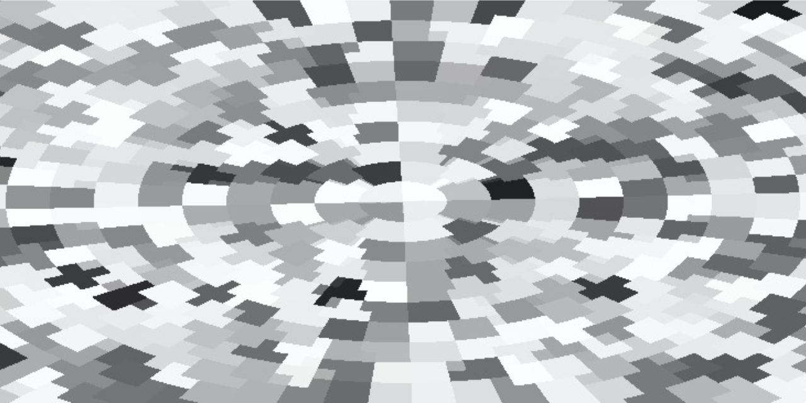
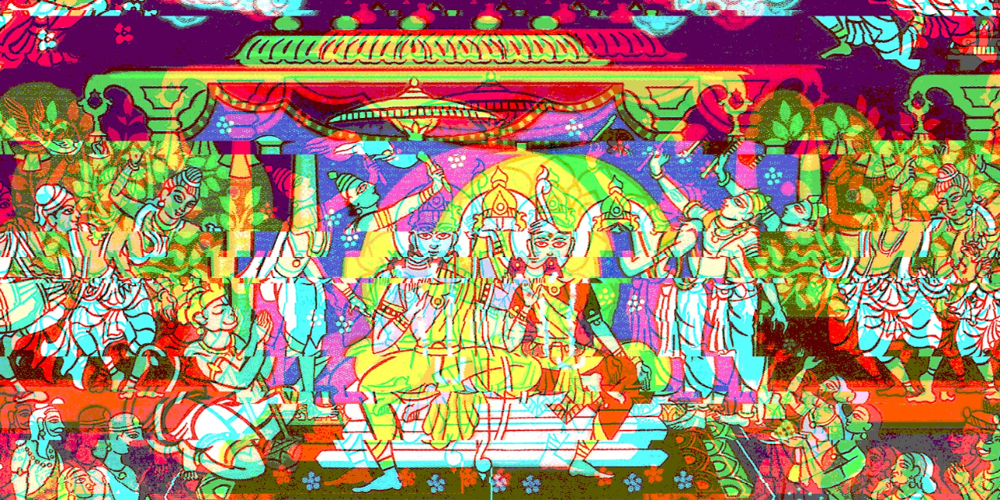

# Cypherbooks

Graph constructs (cypher / GQL / SPARQL / JSON) of books' nouns, events and relations node-by-node, edge-by-edge

## Don Delillo: White Noise (1985)

here it is

## Valmiki (attributed): The Ramayana

more to come
