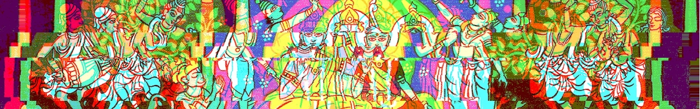

# Cypherbooks

Graph constructs (cypher / GQL / SPARQL / JSON) of books' nouns, events and relations node-by-node, edge-by-edge.

## Utilities
This repo also contains some small utilities, that help to automate data entry and handling. These can be found in the [utilities folder](https://github.com/evilcloud/cypherbooks/tree/master/utils)

## Don DeLillo: White Noise (1985)

White Noise is considered one of, if not _the_, best work of the American author Don DeLillo. The novel is a prime example of postmodernist literature, both by the content and by form.

The narrative in the book is protagonist-centric and is told only from his point of view, thus he is the central point in the graph with all other important nodes branching out from him.

The book is broken down into Parts and Chapters. 

## रामायणम्

The Ramayana is one of the three (if we consider Bhagavat Gita as an independent entity, rather than a part of Mahabharata) epics from ancient India. The authorship of the work is attributed to Valmiki, though it is most certainly a body of work of several people.
