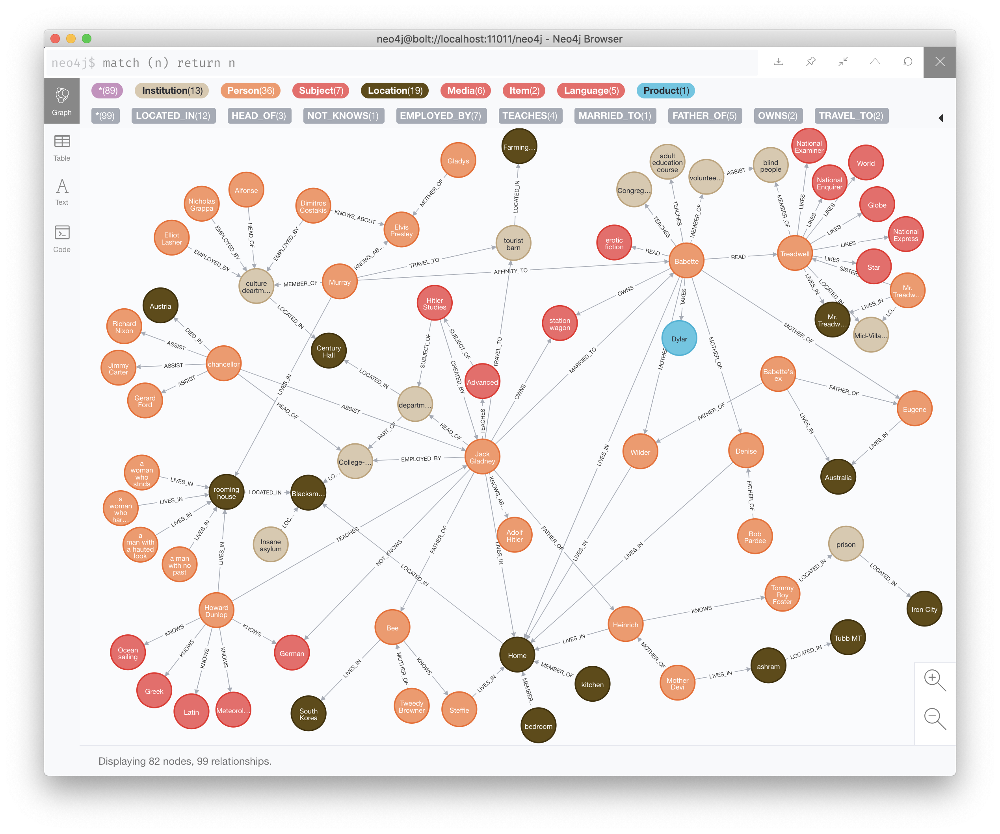
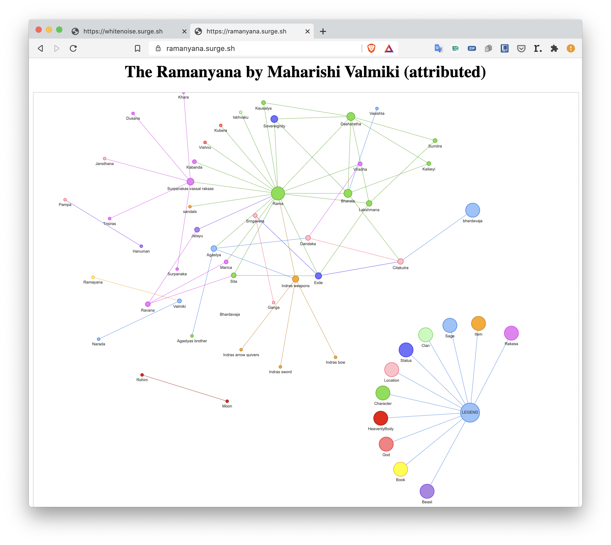

# Cypherbooks

Graph constructs (cypher / GQL / SPARQL / JSON) of books' nouns, events and relations node-by-node, edge-by-edge.

## UPDATE:

despite the prominent presence of the term `cypher` in the project name, I am experimenting with other formats, that may be better for storing and parsing graphs, and what's really important, easier for data entry. Currently I am experimenting with YAML. The format gets a lot of hate in the dev community, which I feel is often unjustified. The major advantage is the ease of parsing -- a lot of data is lost when parsing cypher with Python. Not here. Let's see how that goes.

## Utilities

This repo also contains some small utilities, that help to automate data entry and handling. These can be found in the [utilities folder](https://github.com/evilcloud/cypherbooks/tree/master/utils)

## Don DeLillo: White Noise (1985)

White Noise is considered one of, if not _the_, best work of the American author Don DeLillo. The novel is a prime example of postmodernist literature, both by the content and by form.

The narrative in the book is protagonist-centric and is told only from his point of view, thus he is the central point in the graph with all other important nodes branching out from him.

The book is broken down into Parts and Chapters.

Current state of progress (as of the time of this document -- chapter 10)

there is also the HTML version of the same database (incomplete) generated with pyvi framework

The simplified, but interactive graph of this book can be found [here](http://whitenoise.surge.sh)

## रामायणम्

The Ramayana is one of the three (if we consider Bhagavat Gita as an independent entity, rather than a part of Mahabharata) epics from ancient India. The authorship of the work is attributed to Valmiki, though it is most certainly a body of work of several people.

Currently the development has paused, as I am reviewing the entry criteria

Again, the interactive, albeit simplified version is on [surge](https://ramanyana.surge.sh/)

## Made in Japan: Studies in Popular Music (2014)

an academic study of the genealogy of Japanese popular music from Takarazuka Revue to Enka. J-pop and EDM are not addressed in the book.

This book is the first attempt at non-fiction format.
