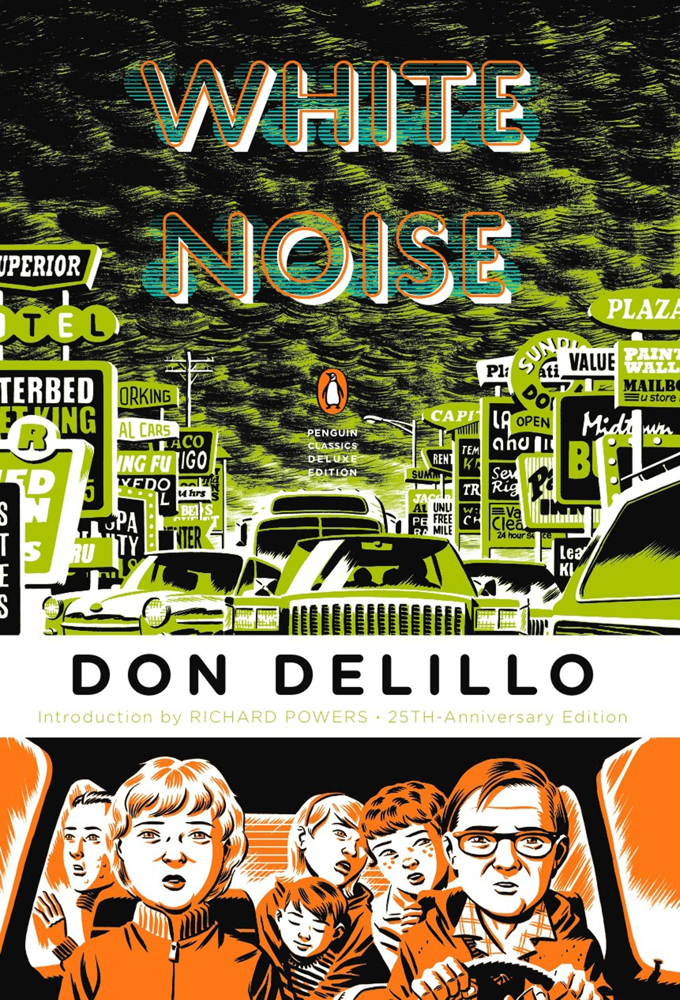

# White Noise by Don DeLillo

**Link to the graph is [here](https://whitenoise.surge.sh/)**

DeLillo's arguably most famous novel, and the one that has served as a breakthrough for him into the mainstream as an author. Today the work is considered to be a canonical postmodernist writing.

The story is presented from the first-person perspective of the protagonist, thus the world is centered around the main character, his actions, knowledge, and opinions. As the narrator the protagonist is relatively reliable, and he does not attempt to manipulate the narrative.

Geospacially the novel is almost claustrophobic, with very few locations between which the characters move continuously. Several references to distant locations only exacerbate this sense. The same feel is also contributed by the characters themselves -- there are few, each with own mission, often painfully obvious of its own irrelevancy to the reader, the work, and to the character. The reader is being tossed between these characters just like the protagonist and his family between the few locations in the suburban town, occasionally reaching outside of those, which almost always lends itself to slight feeling of discomfort.

Personally: the protagonist would be hard to bear, if not for the absurdity of the premise.

