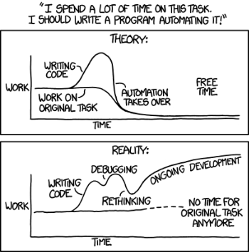
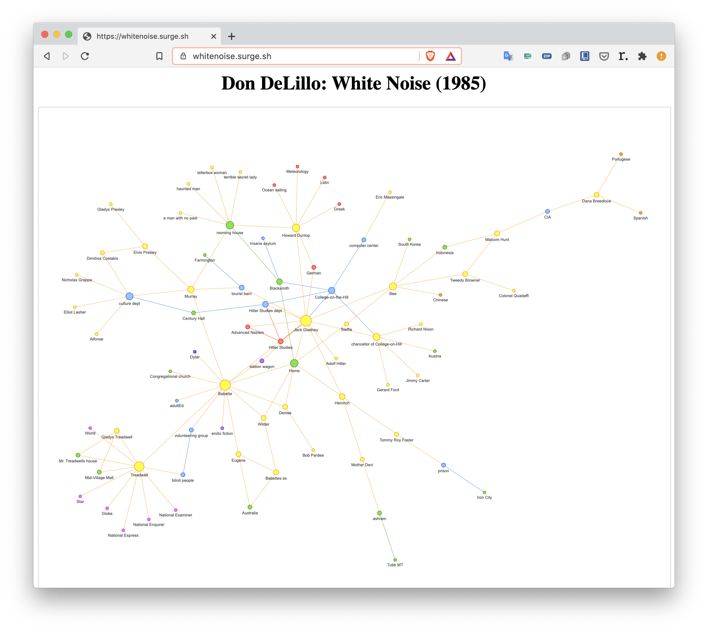

# Utilities

This folder contains simple utilities, that suppose to make data entry and analysis simpler. The utilities are at different stages of development and are not guaranteed to function as advertised, expected, or at all.



_source [xkcd](https://xkcd.com/1319/)_

All within the philosophy of the comic above.

Currently there are:

## CHAPTERS

A small utility, which will scan your cypher file for chapters which are declared like this:

```
// Not captured
// {part: DECLARE}
    // {chapter: 1}
    (something:Something {name: "ONE")
    // {chapter: 2}
    (nothing:Something {name: "NIL"})
// {part: CONNECT}
    // {chapter: 3}
    (nothing)-[:NOT_FOLLOWED_BY]->(something)
```

and insert the chapter formations into properties like that:

```
// Not captured
// {part: DECLARE}
    // {chapter: 1}
    (something:Something {name: "ONE", part: "DECLARE", chapter: 1)
    // {chapter: 2}
    (nothing:Something {name: "NIL", part: "DECLARE", chapter: 2})
// {part: CONNECT}
    // {chapter: 3}
    (nothing)-[:NOT_FOLLOWED_BY {part: "CONNECT", chapter: 3}]->(something)
```

The format of the chapter declaration is `// {}'. Tabs and spaces are ignored (but kept). Only the values within the first curly brackets in the line are captured.

The chapter values are compoundable (any number of divisions possible to be marked -- chapters, parts, tomes, whatever) and replaceable if the key is the same. No automatic number increase is enabled, since it presents more issues than solution. The magic is brought to the minimum.

Currently only simple patterns are supported, that is `(node {full_syntaxis_possible: true})-[:RELATIONSHIP {bi_directional: true}]->(node)`. In the relationship command only the edge part will be evaluated, and nodes ignored. To work with nodes, individual node statements are necessary.

The "ongoing development" stage is definitely on, as I am trying to rewrite the whole thing is some niche language like [Nim](https://nim-lang.org/) or [V](https://vlang.io/)

## CY2PYVIS

for those, who don't want to fire up Neo4j every time they want to see the general outline of relationships between elements -- parses cypher straight into html (pyvi with JS, I assume).

Currently terrible code -- real kludge, because, I don't know, I was tired or something.


